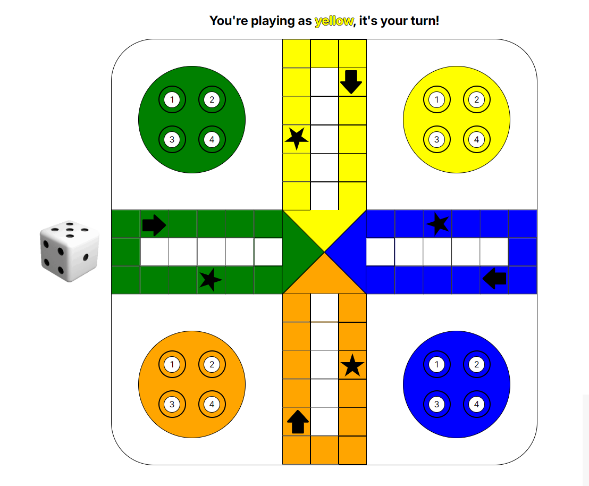

# LUDO GAME MADE IN ANGULAR

This is my remake attempt of my Ludo game project, it is fully functional and playable! And you can play it in the github page of this project!

i'll put the url here later...

I've got lots to learn yet about coding but this was one of my coolest project yet i made (it's the only one _for now_).

The jump from simple C++ to the homunculus that is OOP on Typescript is something to get used to, but as long as you're doing it enough times you'll definitely get it someday. 

If somehow you found this weird project and did not enter the world of Web Development or even simple coding, i highly advise you to start, even though it takes a while to get something right. The biggest issue of learning is comparing your progress to the progress of others, sure; it's fine to raise your own bar, but it's not wise to keep following dreams that are not even your own. There is a reason for everyone here on this planet, and i **hope you excel at your most desired dream**.

